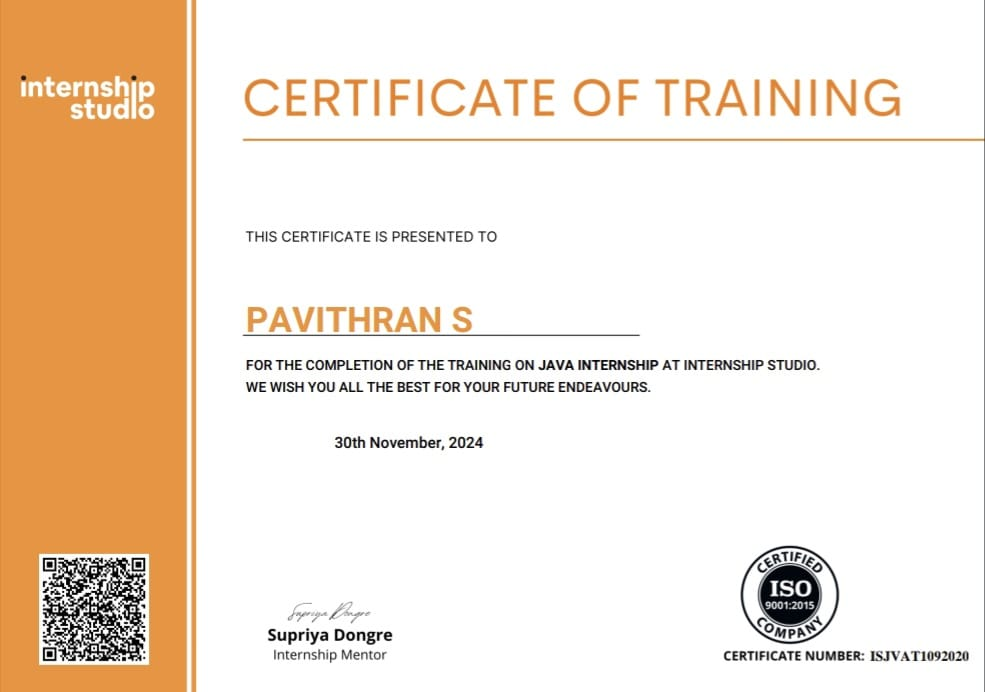
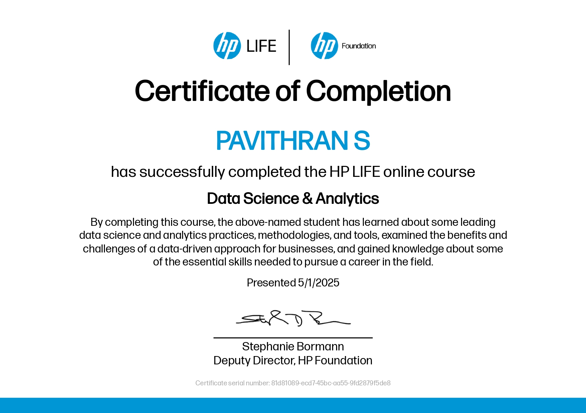
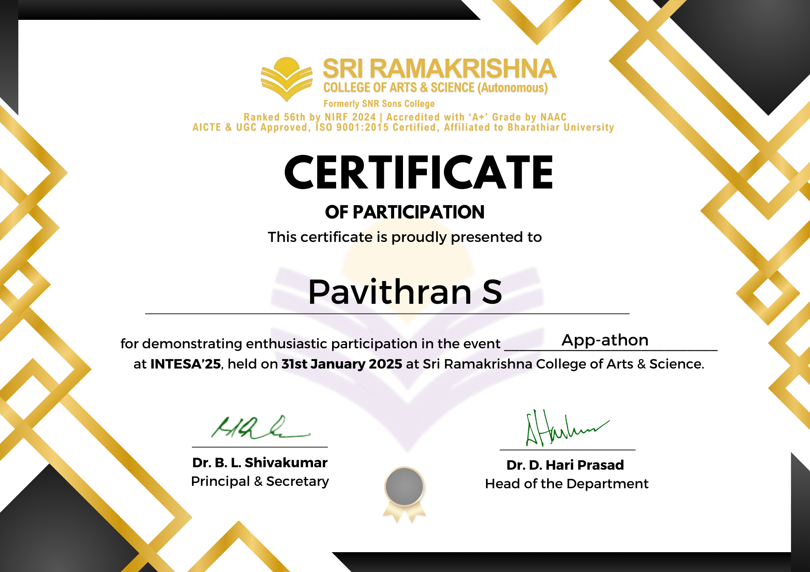
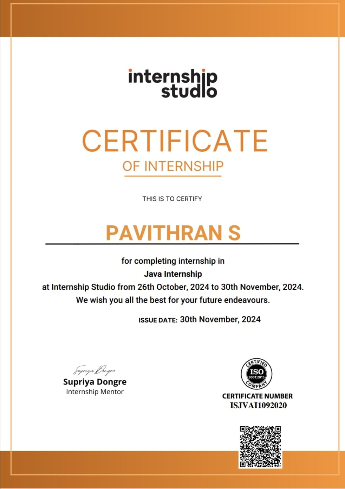
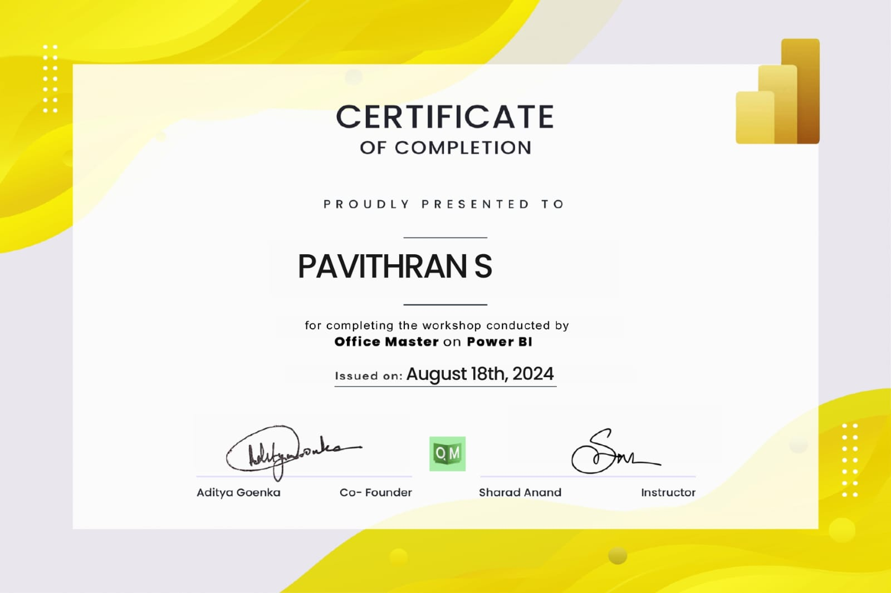
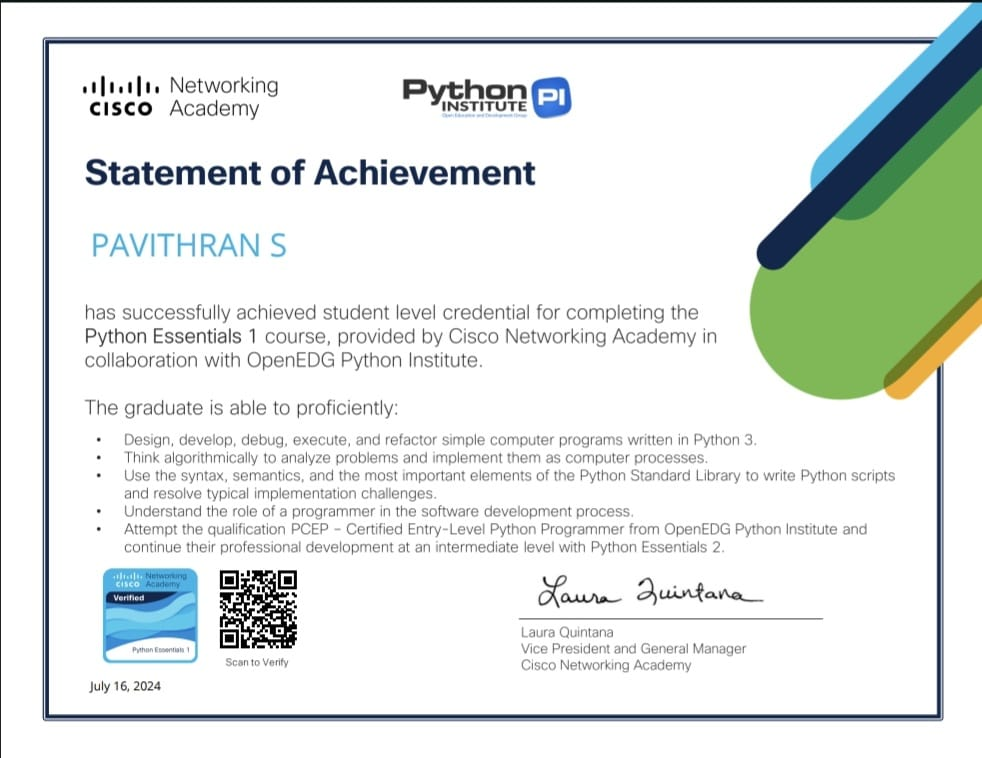
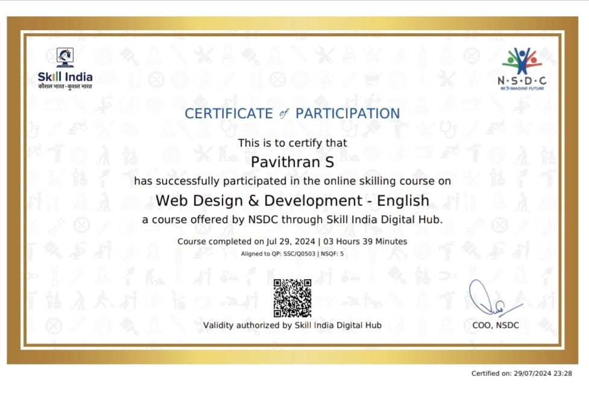
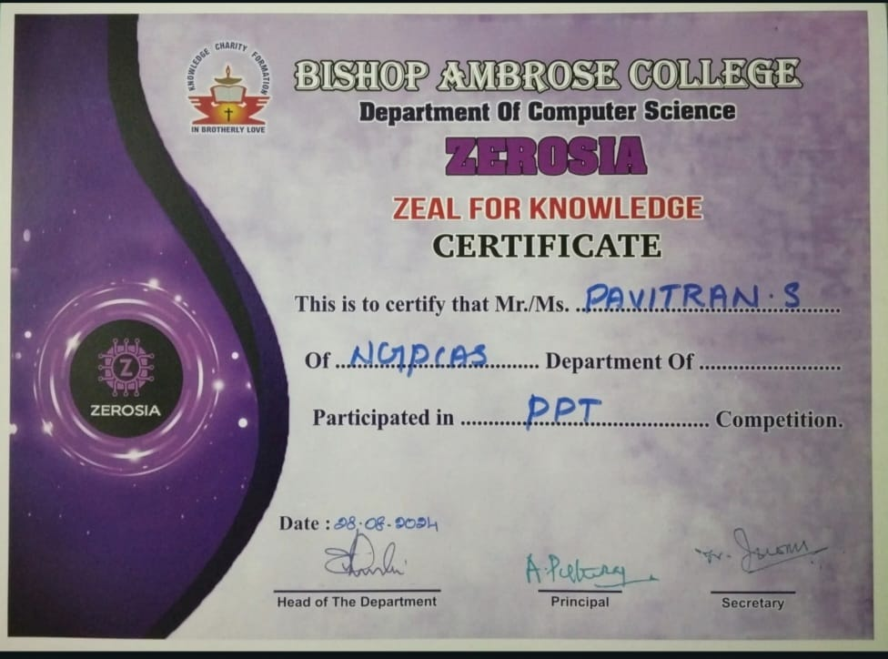
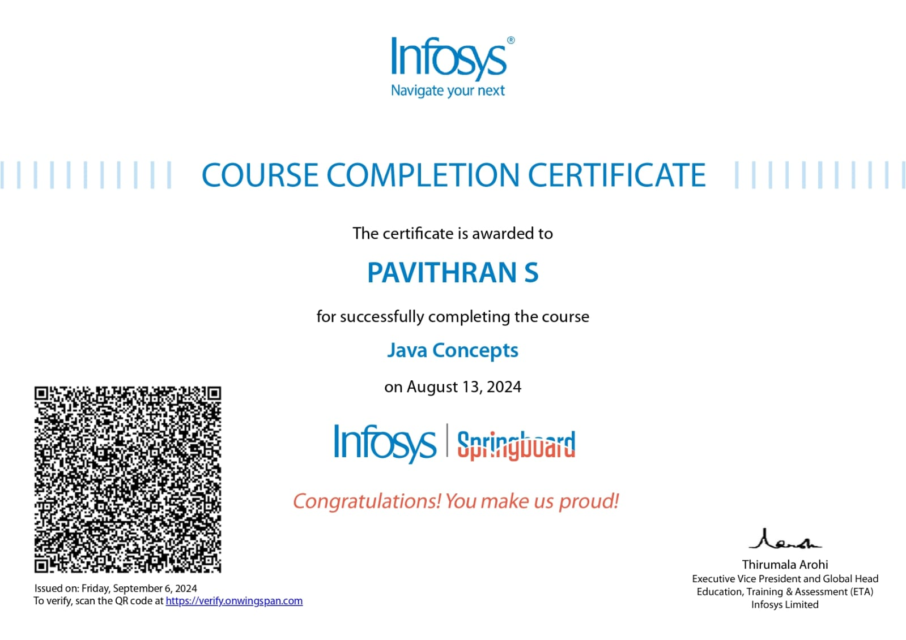
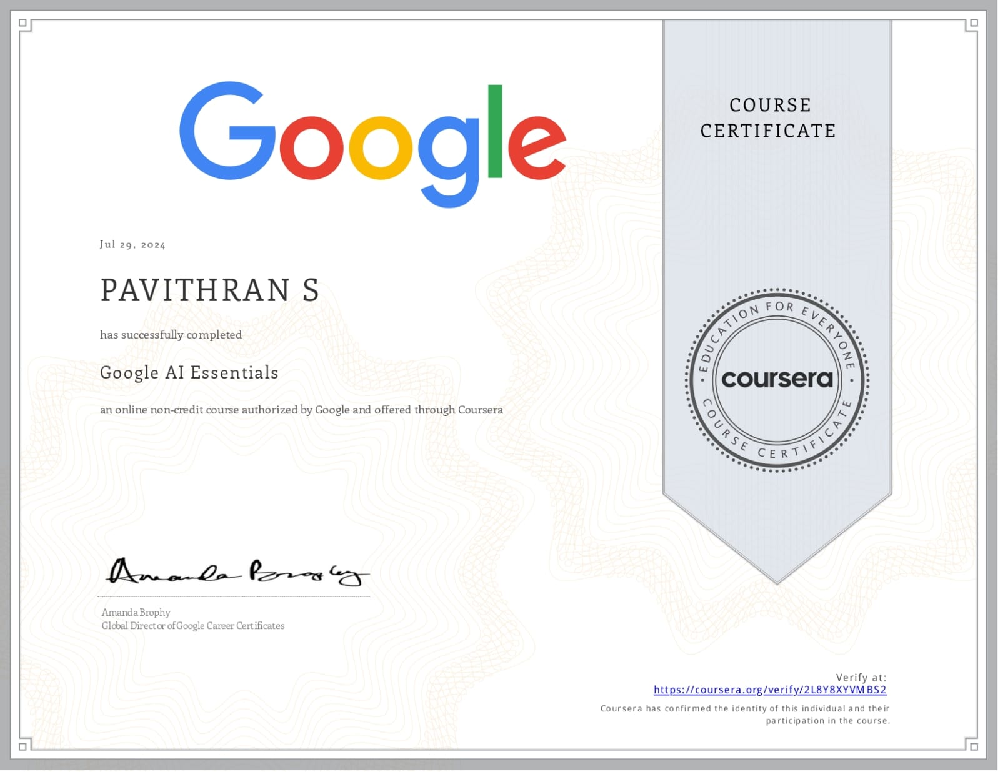

<h1 align="center">Hi 👋, I'm Pavithran S</h1>
<h3 align="center">A passionate Software developer & DATA Analyst</h3>

  

- 📫 How to reach me **pavithran2004cs@gmail.com**

<h3 align="left">Connect with me:</h3>

# 💻 Tech Stack:
     
# 📊 GitHub Stats:
 
 

 

 

 

  

&nbsp;

<h2>winnings</h2>

━━━━━━ ✨ ━━━━━━  
   🏅 KALAM 2025 HACKATHON CHAMPIONS    
   🥇 1st Place | Sri Shakthi Institute of Engineering & Technology (Autonomous)  
   📍 Coimbatore | 21-22 March 2025  
━━━━━━ ✨ ━━━━━━

<h2>Internships</h2>
Java Internship Training | Internship Studio  
📅 Completed: 30th November, 2024 
🔖 Certificate No.: ISJVAT1092020 | ISO 9001:2015 Certified

Successfully completed intensive training in <b>Java programming</b> under mentor <b>Supriya Dongre</b>.  

<b>🚀 Experience</b>
Software Development Intern @ Cognifyz Technologies  
Apr 2025 - May 2025  
Developed and optimized software solutions using Python and JAVA.  
Recognized for dedication, teamwork, and problem-solving skills.  
https://www.cognifyz.com  

<h2>Portfolio</h2>

Do you wanna know more about me

https://pavis.vercel.app/

<h2>Certifications</h2>

 

  <marquee behavior="scroll" direction="right" scrollamount="10">
    
    
    
    
    

  </marquee>

