<h1 align="center">Hi 👋, I'm Pavithran S</h1>
<h3 align="center">
  🚀 Full Stack Developer | Next.js • Django • PostgreSQL <br/>
  🤖 AI/ML & Data Analytics | 📱 Flutter Developer
</h3>

<p align="left">
  
</p>

<hr>

📫 How to reach me: **pavithran2004s@gmail.com**

<hr>


## 💻 Tech Stack

### 🧑‍💻 Programming Languages


---

### 🌐 Web Development


---

### ⚙️ Frameworks & Libraries


---

### 🎨 UI / Frontend Tools


---

### 📱 Mobile Development


---

### 🗄️ Databases


---

### ☁️ Cloud & Deployment


---

### 🤖 Data Science & Machine Learning


---

### 🔧 Tools & DevOps


<hr>

## 📊 GitHub Stats

<p align="left">
  
</p>

<p>
  
</p>

<p align="left">
  <a href="https://github.com/ryo-ma/github-profile-trophy">
    
  </a>
</p>

<p>
  
</p>

<hr>

## 🏆 Winnings

```
━━━━━━ ✨ ━━━━━━
  🏅 KALAM 2025 HACKATHON CHAMPIONS
  🥇 1st Place | Sri Shakthi Institute of Engineering & Technology (Autonomous)
  📍 Coimbatore | 21–22 March 2025
━━━━━━ ✨ ━━━━━━
```

<hr>

## 💼 Internships

**Java Internship Training | Internship Studio**
- 📅 Completed: 30th November, 2024
- 🔖 Certificate No.: ISJVAT1092020 | ISO 9001:2015 Certified
- ✅ Successfully completed intensive training in **Java programming** under mentor **Supriya Dongre**

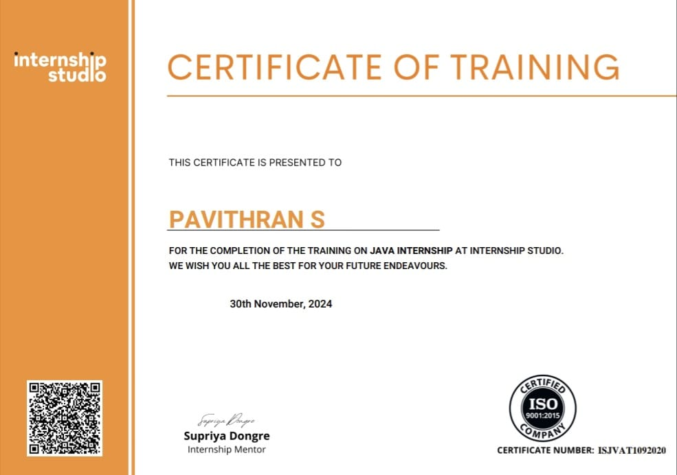

<hr>

## 🚀 Experience

**Software Development Intern @ [Cognifyz Technologies](https://www.cognifyz.com)**
- 📅 Apr 2025 – May 2025
- Developed and optimized software solutions using Python and Java
- Recognized for dedication, teamwork, and problem-solving skills

<hr>

## 🧠 Projects

### 🤖 Sattam AI — Tamil Nadu Law Chatbot

> **Postgraduate Final Year Major Project** | N.G.P Arts and Science College, Coimbatore (2026)

**Sattam AI** is a full-stack, AI-powered legal assistant specialized for Tamil Nadu laws. It ingests Tamil Nadu legal PDFs (acts, rules, regulations), processes them into a vector database using **RAG (Retrieval-Augmented Generation)**, and provides intelligent chat-based querying across web and mobile platforms.

**✨ Key Features**
- 🔍 **RAG Pipeline** — Sentence-transformer embeddings from legal PDFs stored in ChromaDB
- 🧠 **Multi-LLM Support** — Google Gemini (free tier) or OpenAI-compatible via Cloudflare AI Gateway
- 📄 **Document Management** — Upload & process Tamil Nadu law PDFs with web scraping support
- 💬 **Real-time Chat** — Context-aware responses on both web and mobile
- 🔐 **Auth** — Clerk integration for user management
- 📱 **Cross-Platform** — Flutter mobile app + Next.js web app
- 📚 **Data** — Pre-loaded with 50+ Tamil Nadu acts & rules

**🛠️ Tech Stack**

| Layer | Technologies |
|---|---|
| Backend | FastAPI · LangChain · ChromaDB · Python 3.10+ |
| Web Frontend | Next.js 16+ · React 19 · TailwindCSS · Clerk |
| Mobile App | Flutter 3.8+ · Dart · Clerk Flutter |
| AI / ML | Google Gemini · OpenAI · sentence-transformers |

[](https://github.com/Pavithran26/Major-Project-SATTAM-AI-2026)
[](https://pavithran26.github.io/Major-Project-SATTAM-AI-2026)

<hr>

## 🌐 Portfolio

👉 **[pavis.vercel.app](https://pavis.vercel.app/)** — Know more about me!

<hr>

## 📜 Certifications

<table>
  <tr>
    <td align="center">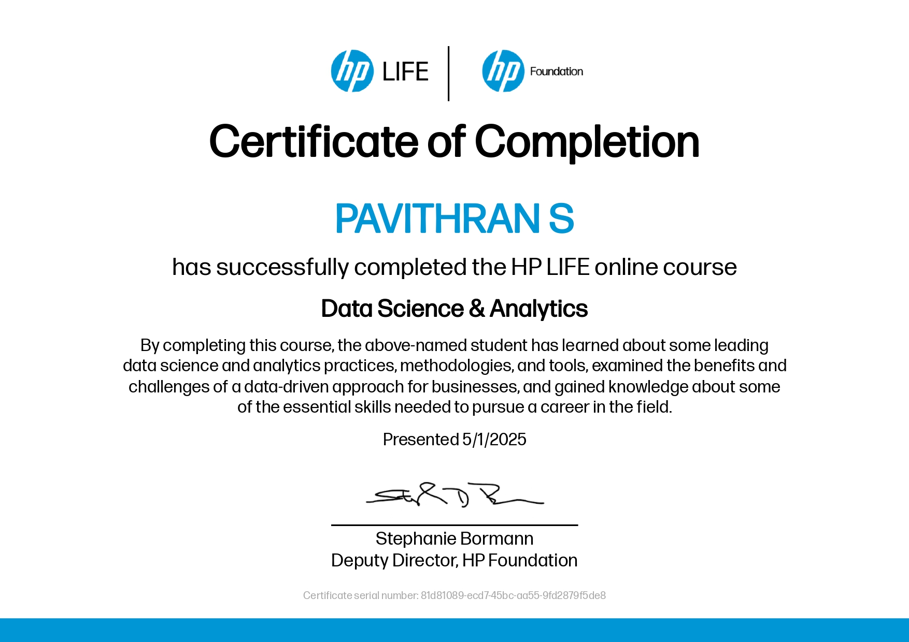</td>
    <td align="center"></td>
    <td align="center">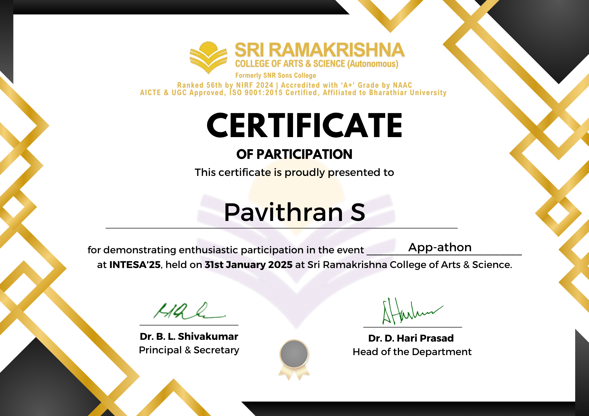</td>
    <td align="center">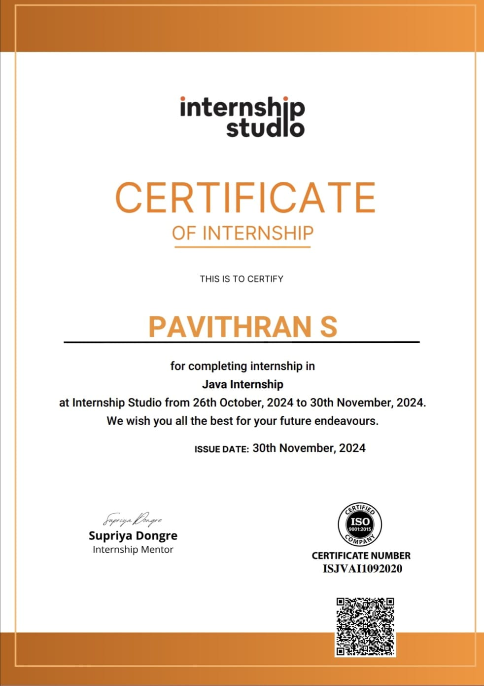</td>
  </tr>
  <tr>
    <td align="center">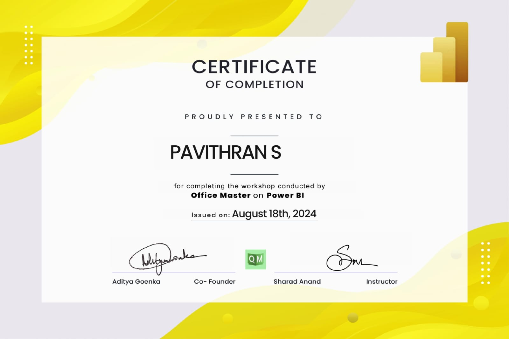</td>
    <td align="center">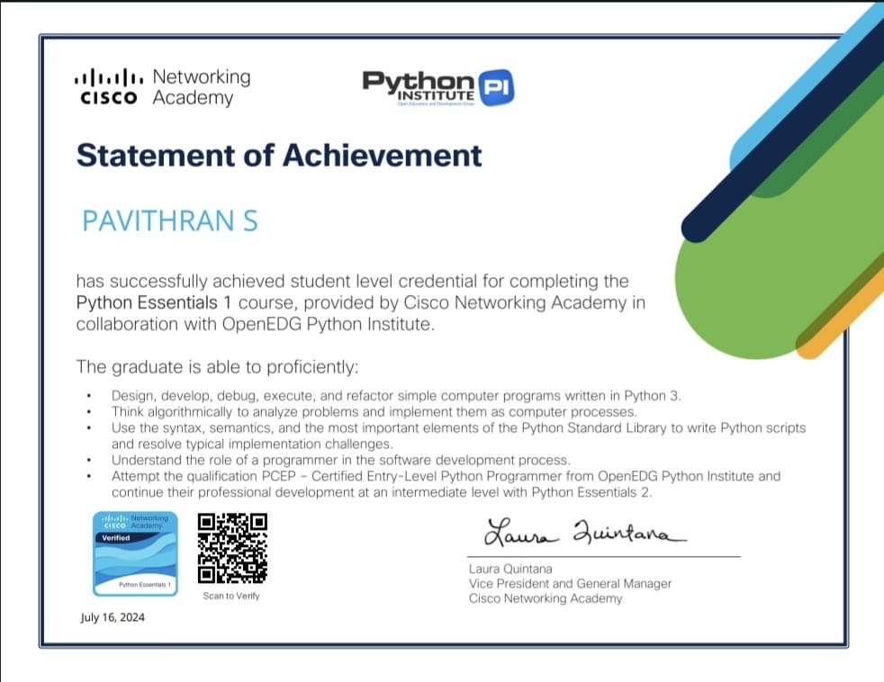</td>
    <td align="center">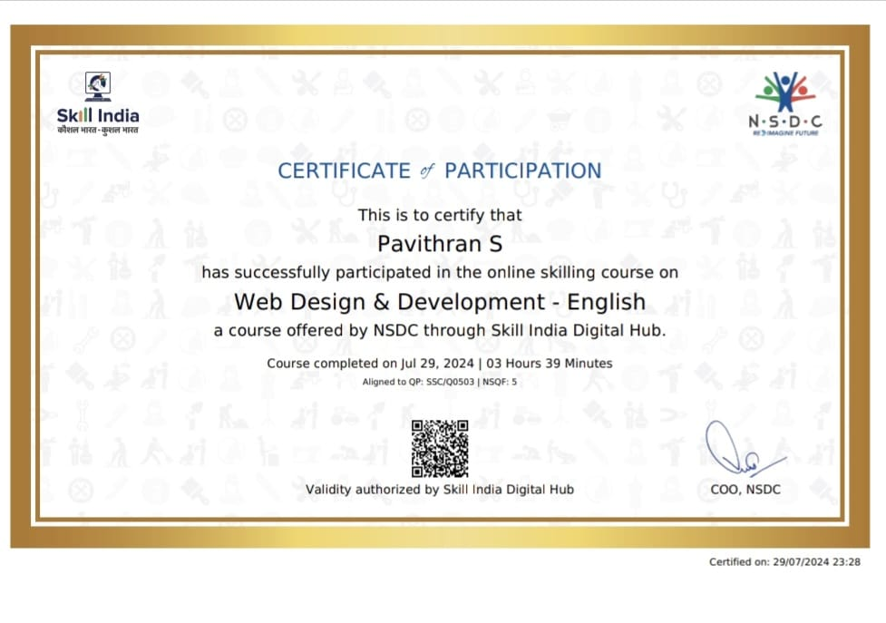</td>
    <td align="center">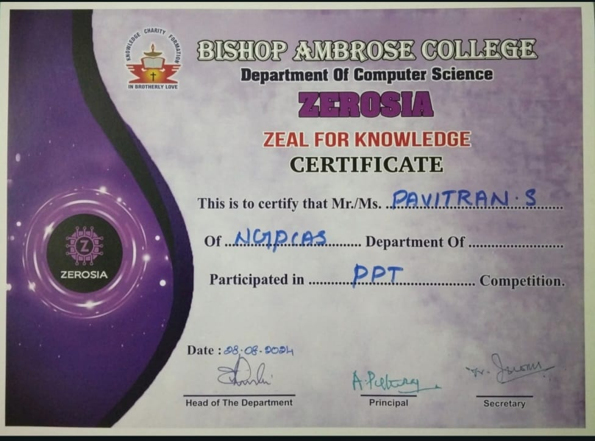</td>
  </tr>
  <tr>
    <td align="center">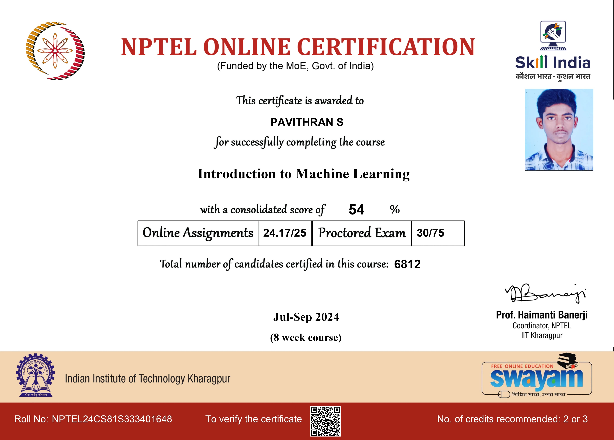</td>
    <td align="center">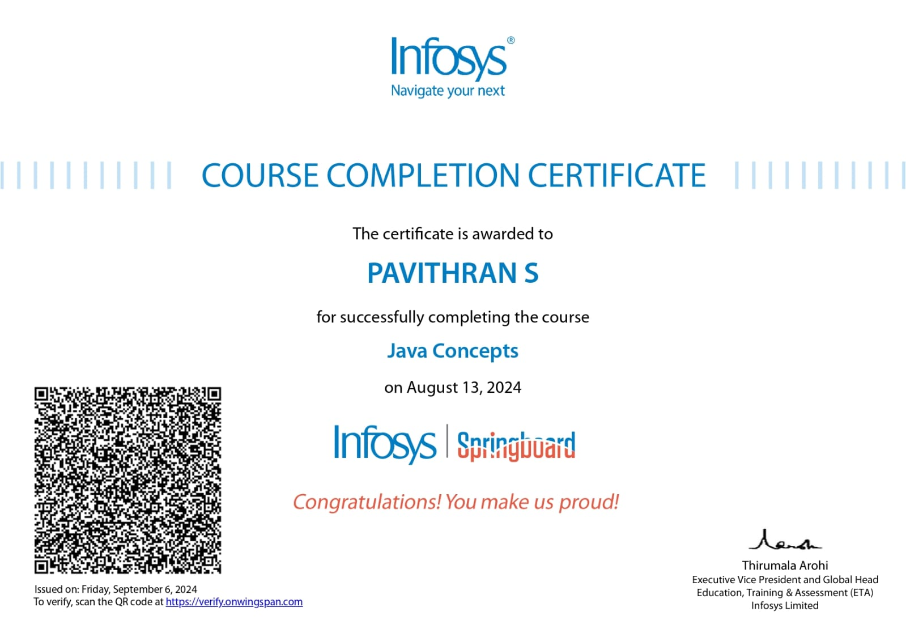</td>
    <td align="center"></td>
    <td align="center">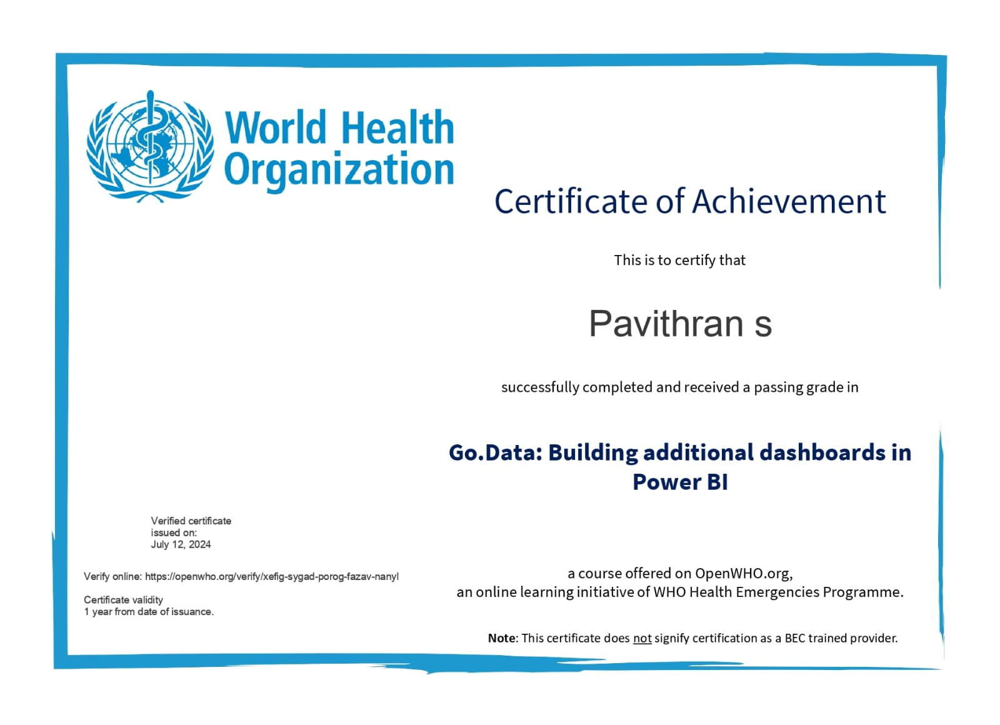</td>
  </tr>
  <tr>
    <td align="center">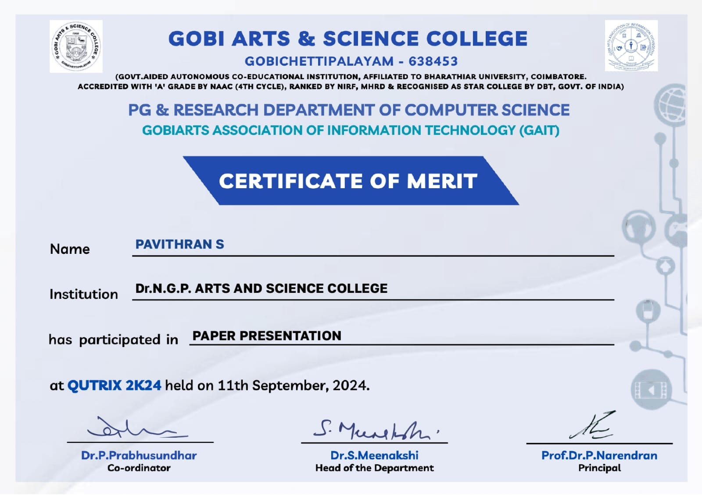</td>
    <td align="center">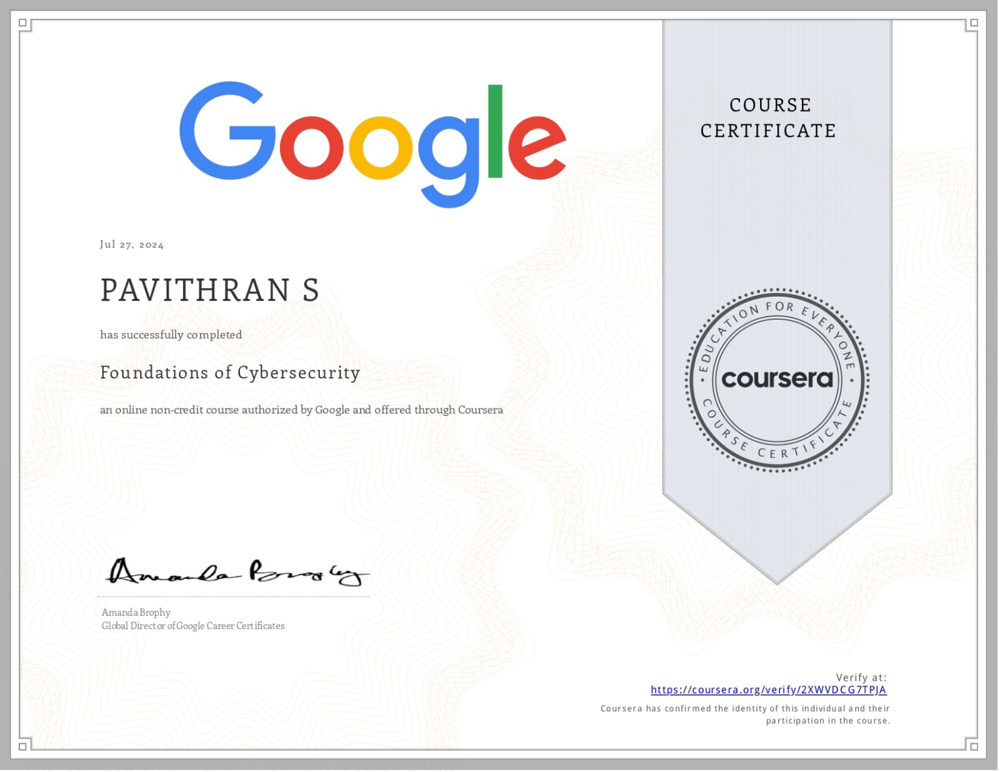</td>
    <td align="center"></td>
    <td align="center">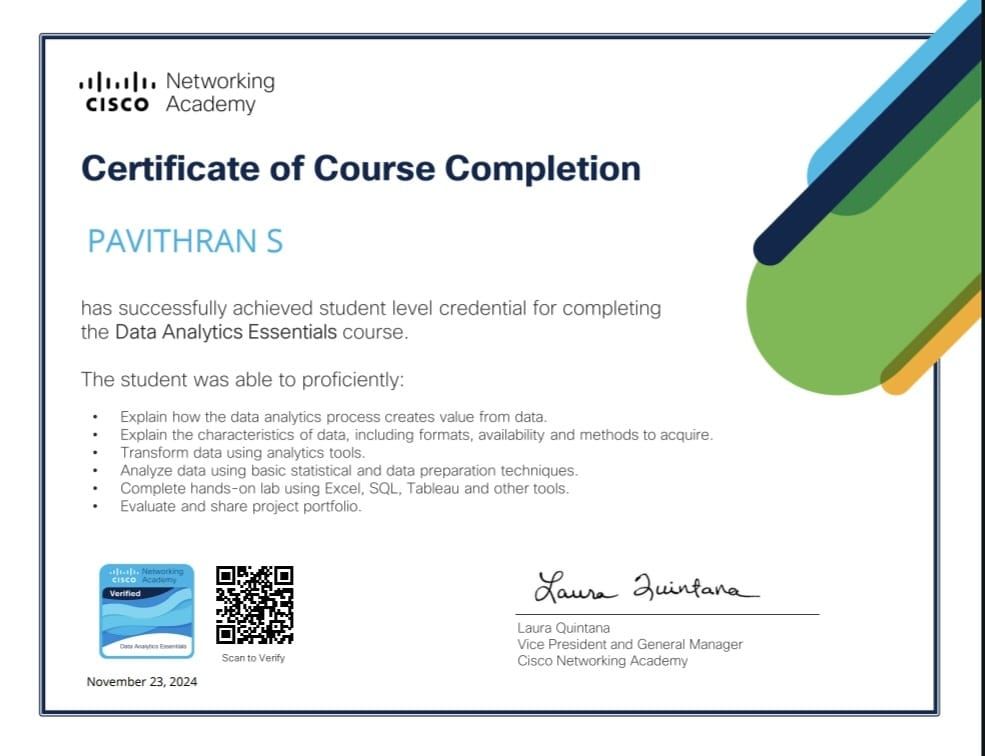</td>
  </tr>
  <tr>
    <td align="center"></td>
    <td></td>
    <td></td>
    <td></td>
  </tr>
</table>


<hr>

<h3 align="left">Connect with me:</h3>
<div align="left" style="display: flex; gap: 10px; align-items: center; flex-wrap: wrap;">
  <a href="https://linkedin.com/in/pavithran-s-ab85a9235" target="_blank">
    
  </a>
  <a href="https://www.hackerrank.com/profile/pavithran2004cs" target="_blank">
    
  </a>
  <a href="https://www.leetcode.com/u/dawn26/" target="_blank">
    
  </a>
  <a href="https://youtube.com/@be_a_techiegamer" target="_blank">
    
  </a>
  <a href="https://www.codechef.com/users/dawn26" target="_blank">
    
  </a>
  <a href="https://auth.geeksforgeeks.org/user/pavithraw7mx" target="_blank">
    
  </a>
</div>
https://leetcode.com/problem-list/whfk0z3g/
<hr>
