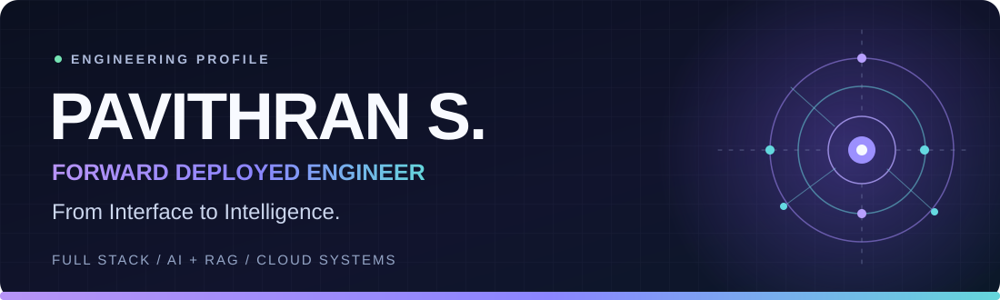
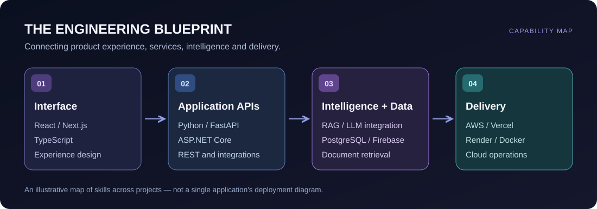
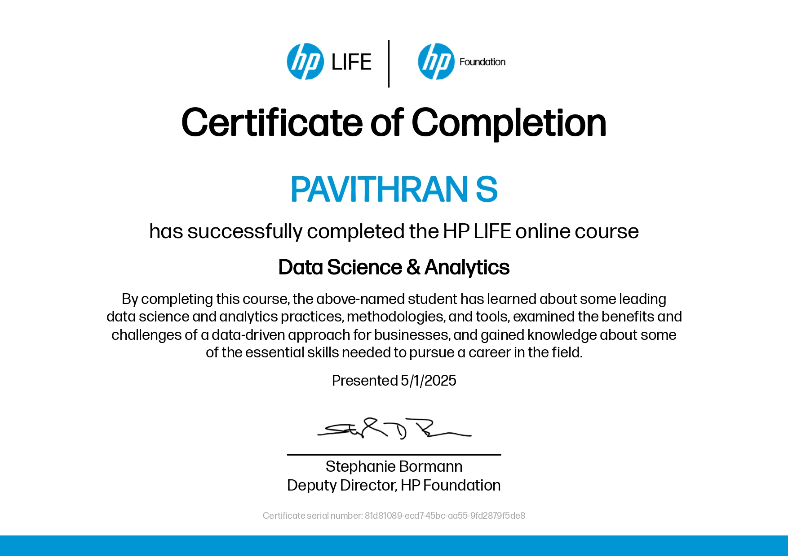
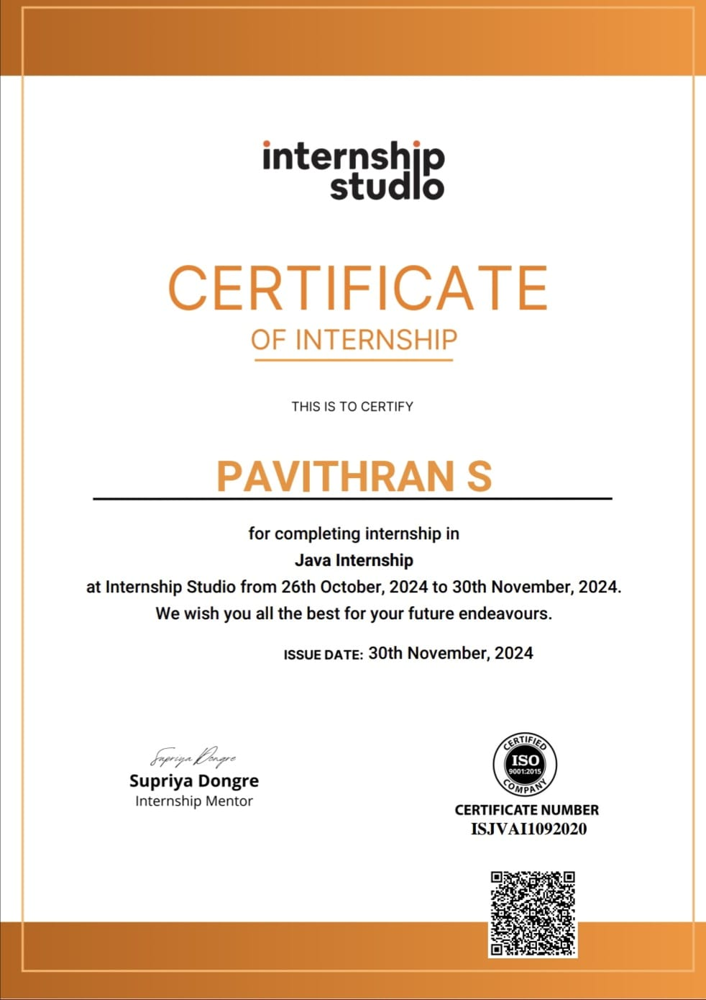
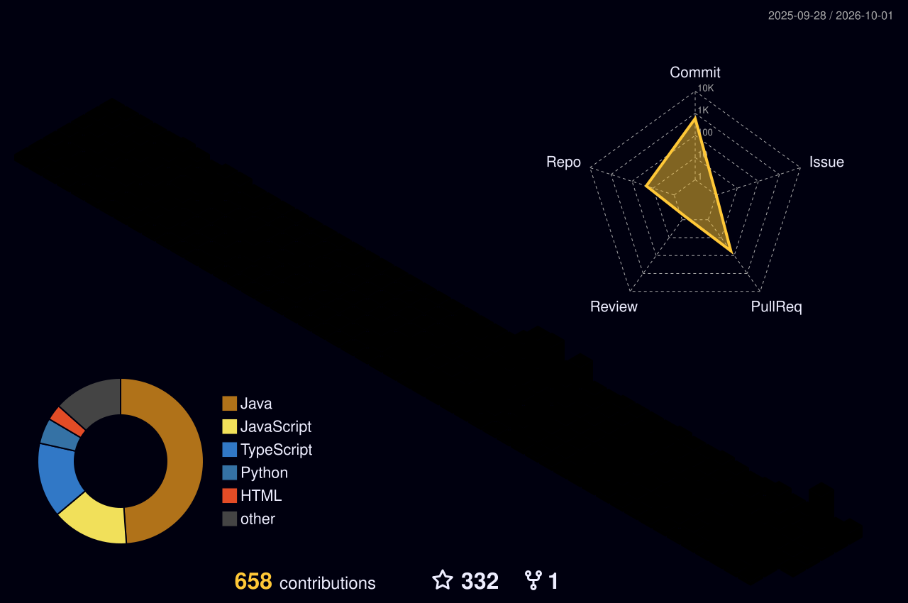

  

   

  
  
  

    

  

## Hello, I'm Pavithran 👋

I work across **product interfaces, backend APIs, AI/RAG workflows and cloud delivery**. I enjoy turning practical problems into connected applications — from the user's first interaction to the services, data and infrastructure behind it.

**My focus:** thoughtful product experiences · grounded AI · clean service boundaries · shipping usable software.

## Selected engineering work

These are four projects that best represent the breadth of what I build. Each has a different problem space rather than being another copy of the same tech demo.

### `01` Sattam AI — Tamil Nadu legal information assistant

> A Tamil Nadu-focused, multilingual legal-information assistant designed around legal documents and evidence-grounded retrieval.

**Engineering focus:** React + Vite · Capacitor · FastAPI · Firebase Authentication · Firestore / vector retrieval · LLM-assisted RAG.

[Explore the active architecture branch ↗](https://github.com/Pavithran26/TN-Sattam/tree/TN_Sattam-Astra)  ·  [Repository ↗](https://github.com/Pavithran26/TN-Sattam)

Provides legal information; it is not a substitute for professional legal advice. The active TN_Sattam-Astra architecture differs from the older default-branch README.

---

### `02` ClanSure — family insurance and policy intelligence

> An insurance management portal bringing together family records, policy documentation, document storage and AI-assisted policy understanding.

**Engineering focus:** React · ASP.NET Core 8 · Python/FastAPI RAG service · PostgreSQL · document/object storage.

[Live application ↗](https://clansure.vercel.app/)  ·  [API ↗](https://clansure-api.onrender.com/)  ·  [AI service ↗](https://clansure-rag.onrender.com/)  ·  [Source ↗](https://github.com/Pavithran26/CLANSURE)

---

### `03` GT Companion — full-stack companion platform

> A React-based companion portal connected to .NET backend services and a Python FastAPI AI/RAG component.

**Engineering focus:** frontend/backend integration · REST services · retrieval workflows · deployment architecture.

[Live application ↗](https://gt-companion.vercel.app/)  ·  [Source ↗](https://github.com/Pavithran26/GT-Companion)

---

### `04` SRK Coconut ERP — business operations

> A business-oriented application for organizing the operational workflows of a coconut business.

**Engineering focus:** business workflow design · operational interfaces · application development.

[Live application ↗](https://ranjiths.vercel.app/)

 

**Also exploring the visual side of engineering:** [PrismIQ — interactive innovation showcase ↗](https://prismiq26.vercel.app/) · [Source](https://github.com/Pavithran26/PrismIQ-Portfolio)

## The engineering blueprint

  

The illustration represents my **cross-project toolkit**, not a claim that every featured application shares one architecture.

| Area | Tools and technologies |
| :--- | :--- |
| **Interface** | React, Next.js, TypeScript, Tailwind CSS |
| **APIs & services** | Python, FastAPI, ASP.NET Core / C#, Django, REST APIs |
| **Applied AI** | LLM integrations, RAG, embeddings, document retrieval |
| **Data & storage** | PostgreSQL, Firebase / Firestore, AWS S3 |
| **Delivery** | Docker, GitHub Actions, Vercel, Render, AWS |
| **Also worked with** | Java, Flutter / Dart |

## Milestones & experience

- **KALAM 2025 — Hackathon Champion / First Place** · Sri Shakthi Institute of Engineering & Technology, Coimbatore · 21–22 March 2025.
- **Software Development Intern** · Cognifyz Technologies · Apr–May 2025.
- **Java Internship Training** · Internship Studio · completed November 2024.

  
<b>Selected certificates</b>

   
  
  

## GitHub activity

  <picture>
    <source media="(prefers-color-scheme: dark)" srcset="https://raw.githubusercontent.com/Pavithran26/Pavithran26/output/github-snake-dark.svg" />
    <source media="(prefers-color-scheme: light)" srcset="https://raw.githubusercontent.com/Pavithran26/Pavithran26/output/github-snake.svg" />
    
  </picture>

  
<b>Explore the 3D contribution graph</b>

   
  

    
  

## Connect

**Let's turn useful ideas into working systems.**

[Portfolio](https://pavithran26.vercel.app/) · [LinkedIn](https://www.linkedin.com/in/pavithran26s/) · [GitHub](https://github.com/Pavithran26) · [LeetCode](https://www.leetcode.com/u/dawn26/) · [Email](mailto:pavithran2004s@gmail.com)

 

From Interface to Intelligence · Pavithran S.

