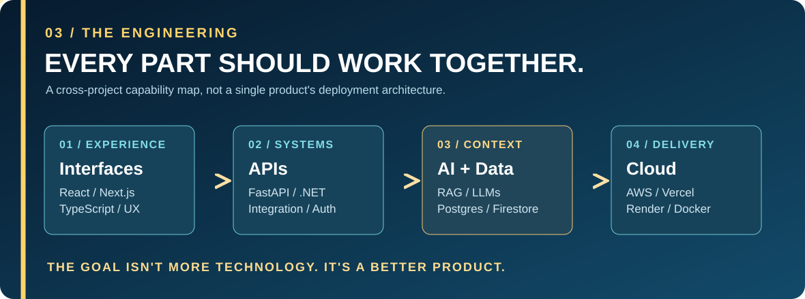
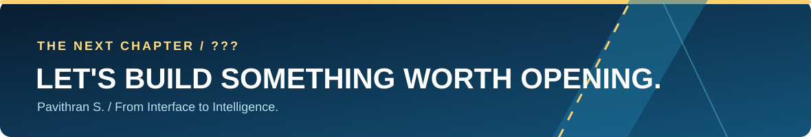

<!-- PAVI / ENGINEERING PROFILE · v4 editorial redesign -->

<picture>
  <source media="(max-width: 650px)" srcset="./assets/pavi-cover-mobile-v4.svg" />
  
</picture>

 

**The engineer behind the experience.** Building useful software at the intersection of product, full stack and applied AI.

 

[**EXPLORE MY PORTFOLIO ↗**](https://pavithran26.vercel.app/) &nbsp;·&nbsp; [**LET'S CONNECT ↗**](https://www.linkedin.com/in/pavithran26s/) &nbsp;·&nbsp; [**SAY HELLO ↗**](mailto:pavithran2004s@gmail.com)

 

## 01 / THE MINDSET

> Interfaces should feel effortless. Intelligence should be useful. Engineering should turn ideas into something that works.

I move between **product UI, service architecture, retrieval-based AI and cloud deployment**. These projects tell that story more clearly than a wall of technology logos.

 

## 02 / THE WORK

*Different problems. Different architectures. One obsession: making the whole experience work.*

**The problem:** Managing family insurance policies and understanding what's inside complex documents.  
**The build:** React experience · ASP.NET Core 8 services · FastAPI/RAG integration · PostgreSQL and object storage.  
[**LAUNCH CLANSURE ↗**](https://clansure.vercel.app/) &nbsp;·&nbsp; [API](https://clansure-api.onrender.com/) &nbsp;·&nbsp; [RAG](https://clansure-rag.onrender.com/) &nbsp;·&nbsp; [Source](https://github.com/Pavithran26/CLANSURE)

 

**The problem:** Bringing portal workflows, backend services and AI-powered retrieval together.  
**The build:** React frontend · .NET/C# backend · Python FastAPI AI/RAG service.  
[**OPEN GT COMPANION ↗**](https://gt-companion.vercel.app/) &nbsp;·&nbsp; [Source](https://github.com/Pavithran26/GT-Companion)

 

**The problem:** Making Tamil Nadu legal information easier to explore across languages.  
**Active architecture:** React/Vite + Capacitor · FastAPI · Firebase Authentication · Firestore vector retrieval · LLM-assisted RAG.  
[**EXPLORE SATTAM AI ↗**](https://github.com/Pavithran26/TN-Sattam/tree/TN_Sattam-Astra) &nbsp;·&nbsp; [Repository](https://github.com/Pavithran26/TN-Sattam)

Development project; offers legal information, not professional legal advice. The active TN_Sattam-Astra branch reflects the newer Firebase-first direction.

  

**The problem:** Organizing the day-to-day operations of a coconut business.  
**The build:** Business workflow design · operational interfaces · application engineering.  
[**EXPLORE SRK COCONUT ERP ↗**](https://ranjiths.vercel.app/)

 

**An extra experiment in visual storytelling:** [PrismIQ — Interactive Innovation Showcase ↗](https://prismiq26.vercel.app/) · [Source](https://github.com/Pavithran26/PrismIQ-Portfolio)

The panels above are original conceptual project artwork, not claimed screenshots. Each linked project opens the actual application or development branch.

 

## 03 / BEHIND THE SCREEN

**Tools in the workflow:** React · Next.js · TypeScript · Python · FastAPI · ASP.NET Core · RAG · PostgreSQL · Firebase / Firestore · AWS · Docker · Vercel · Render.

<b>Explore the wider technical toolkit</b>

 

| Craft | Technologies |
| :--- | :--- |
| Product interfaces | React, Next.js, TypeScript, Tailwind CSS |
| Backends & APIs | Python, Django, FastAPI, ASP.NET Core, Java, REST APIs |
| Applied AI | RAG, embeddings, LLM integrations, document workflows |
| Persistence | PostgreSQL, Firebase, Firestore, AWS S3 |
| Deployment | AWS, Vercel, Render, Docker, GitHub Actions |
| Mobile explorations | React + Capacitor, Flutter / Dart |

 

## 04 / MILESTONES

**🏆 2025 · KALAM Hackathon — Champion / First Place**  
Sri Shakthi Institute of Engineering & Technology, Coimbatore · March 21–22, 2025.

**💼 2025 · Software Development Intern**  
Cognifyz Technologies · April–May 2025.

**☕ 2024 · Java Internship Training**  
Internship Studio · completed November 2024.

<b>Selected certificates</b>

 

 

## 05 / THE ACTIVITY

<picture>
  <source media="(prefers-color-scheme: dark)" srcset="https://raw.githubusercontent.com/Pavithran26/Pavithran26/output/github-snake-dark.svg" />
  <source media="(prefers-color-scheme: light)" srcset="https://raw.githubusercontent.com/Pavithran26/Pavithran26/output/github-snake.svg" />
  
</picture>

<b>Open the 3D contribution visual</b>

 

 

 

[**PORTFOLIO ↗**](https://pavithran26.vercel.app/) &nbsp;·&nbsp; [**LINKEDIN ↗**](https://www.linkedin.com/in/pavithran26s/) &nbsp;·&nbsp; [**GITHUB ↗**](https://github.com/Pavithran26) &nbsp;·&nbsp; [**EMAIL ↗**](mailto:pavithran2004s@gmail.com)

