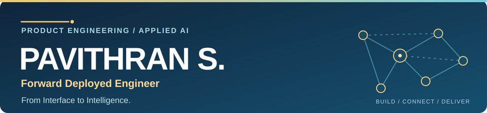
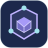

<!-- Pavithran S. | Product-first README v6 -->

  

 

<table>
<tr>
<td width="170" valign="middle" align="center">

</td>
<td valign="middle">
<h3>Hey, I'm Pavi 👋</h3>

<strong>Forward Deployed Engineer (FDE)</strong>

I turn ideas into connected, usable products — from the interface and API to applied AI, data and deployment.

<em>From Interface to Intelligence.</em>

</td>
</tr>
</table>

## 💻 Programming languages

  

**C · C++ · C# · Java · Python · JavaScript · TypeScript · Kotlin · R · Dart**

These are languages I have worked with across application development, learning and experimentation.

## 🚀 Featured projects

Distinct projects, with their own icons and direct links to the relevant application or repository.

<table>
<tr>
<td width="92" align="center" valign="middle"></td>
<td valign="top">
<h3><a href="https://clansure.vercel.app/">ClanSure</a></h3>

Family insurance management with policy and document intelligence.

<strong>Stack:</strong> React · ASP.NET Core 8 · FastAPI/RAG · PostgreSQL · object storage.

</td>
</tr>
<tr>
<td width="92" align="center" valign="middle"></td>
<td valign="top">
<h3><a href="https://gt-companion.vercel.app/">GT Companion</a></h3>

Companion portal bringing frontend, backend and AI retrieval together.

<strong>Stack:</strong> React · .NET/C# · Python FastAPI · RAG microservice.

</td>
</tr>
<tr>
<td width="92" align="center" valign="middle"></td>
<td valign="top">
<h3><a href="https://github.com/Pavithran26/TN-Sattam/tree/TN_Sattam-Astra">Sattam AI</a></h3>

Multilingual Tamil Nadu legal information assistant grounded in source documents.

<strong>Active branch:</strong> React/Vite · Capacitor · FastAPI · Firebase Authentication · Firestore vector retrieval.

</td>
</tr>
<tr>
<td width="92" align="center" valign="middle"></td>
<td valign="top">
<h3><a href="https://ranjiths.vercel.app/">SRK Coconut ERP</a></h3>

Business operations application for day-to-day coconut workflows.

<strong>Focus:</strong> Business workflows · operational UI · application development.

</td>
</tr>
<tr>
<td width="92" align="center" valign="middle"></td>
<td valign="top">
<h3><a href="https://prismiq26.vercel.app/">PrismIQ — Innovation Showcase</a></h3>

Creative 3D and motion-focused innovation showcase.

</td>
</tr>
</table>

Sattam AI is a legal information development project, not professional legal advice. The linked TN_Sattam-Astra branch reflects the newer Firebase-first design.

## 🛠️ Engineering toolkit

| Area | Technologies |
| :--- | :--- |
| **UI / Frontend** | React, Next.js, TypeScript, Tailwind CSS, shadcn/ui |
| **Backend / APIs** | Python, FastAPI, Django, Flask, ASP.NET Core, REST APIs |
| **AI Engineering** | RAG, LLM integration, embeddings, document workflows |
| **Data / Storage** | PostgreSQL, MySQL, Firebase / Firestore, AWS S3 |
| **Cloud / DevOps** | AWS, Vercel, Render, Docker, GitHub Actions |
| **Mobile** | React + Capacitor, Flutter / Dart |

<b>Explore optional 3D design studies</b>

 

These are visual design studies, not interactive WebGL or actual app screenshots.

## 🏆 Experience & achievements

- **KALAM 2025 Hackathon — Champion / First Place**, Sri Shakthi Institute of Engineering & Technology, Coimbatore (21–22 March 2025).
- **Software Development Intern**, Cognifyz Technologies (April–May 2025).
- **Java Internship Training**, Internship Studio (completed November 2024).

<b>Selected certificates</b>

 

## 📈 GitHub activity

<picture>
<source media="(prefers-color-scheme: dark)" srcset="https://raw.githubusercontent.com/Pavithran26/Pavithran26/output/github-snake-dark.svg" />
<source media="(prefers-color-scheme: light)" srcset="https://raw.githubusercontent.com/Pavithran26/Pavithran26/output/github-snake.svg" />

</picture>

<b>Show 3D contribution graph</b>

 

---

**From Interface to Intelligence.**

