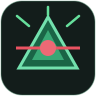

<!-- Pavithran S. | Product-first README v7 • graphite / emerald / crimson -->

  

 

<table>
<tr>
<td width="170" valign="middle" align="center">

</td>
<td valign="middle">
<h3>Hey, I'm Pavi 👋</h3>

<strong>Forward Deployed Engineer (FDE)</strong>

I turn ideas into connected, usable products — from the interface and API to applied AI, data and deployment.

<em>From Interface to Intelligence.</em>

</td>
</tr>
</table>

## 💻 Programming languages

  

Programming, scripting, web and markup — across projects, learning and experiments.

## 🚀 Featured projects

Distinct projects, with their own icons and direct links to the relevant application or repository.

<table>
<tr>
<td width="92" align="center" valign="middle"></td>
<td valign="top">
<h3><a href="https://clansure.vercel.app/">ClanSure</a></h3>

Family insurance management with policy and document intelligence.

<strong>Stack:</strong> React · ASP.NET Core 8 · FastAPI/RAG · PostgreSQL · object storage.

</td>
</tr>
<tr>
<td width="92" align="center" valign="middle"></td>
<td valign="top">
<h3><a href="https://gt-companion.vercel.app/">GT Companion</a></h3>

Companion portal bringing frontend, backend and AI retrieval together.

<strong>Stack:</strong> React · .NET/C# · Python FastAPI · RAG microservice.

</td>
</tr>
<tr>
<td width="92" align="center" valign="middle"></td>
<td valign="top">
<h3><a href="https://github.com/Pavithran26/TN-Sattam/tree/TN_Sattam-Astra">Sattam AI</a></h3>

Multilingual Tamil Nadu legal information assistant grounded in source documents.

<strong>Active branch:</strong> React/Vite · Capacitor · FastAPI · Firebase Authentication · Firestore vector retrieval.

</td>
</tr>
<tr>
<td width="92" align="center" valign="middle"></td>
<td valign="top">
<h3><a href="https://ranjiths.vercel.app/">SRK Coconut ERP</a></h3>

Business operations application for day-to-day coconut workflows.

<strong>Focus:</strong> Business workflows · operational UI · application development.

</td>
</tr>
<tr>
<td width="92" align="center" valign="middle"></td>
<td valign="top">
<h3><a href="https://prismiq26.vercel.app/">PrismIQ — Innovation Showcase</a></h3>

Creative 3D and motion-focused innovation showcase.

</td>
</tr>
</table>

Sattam AI is a legal information development project, not professional legal advice. The linked TN_Sattam-Astra branch reflects the newer Firebase-first design.

## 🧰 My engineering universe

**BUILD** &nbsp; → &nbsp; **INTELLIGENCE** &nbsp; → &nbsp; **DEPLOY** &nbsp; → &nbsp; **EXPERIENCE**

A complete, categorized toolbox — professional projects, hands-on learning and explored technologies; not an equal-proficiency rating.

### 01 / Interface & experience

<b>Frontend • frameworks • component systems</b>

 

  

HTML5 · CSS3 · JavaScript · TypeScript · React · Next.js · Vue · Ember · Vite · Tailwind CSS · Material UI · shadcn/ui · Bootstrap · Babel · npm

<b>3D • motion • visual systems</b>

 

  

Also CSS transitions, scroll-driven motion, responsive design, component systems, interface performance and Figma.

### 02 / Systems & application engineering

<b>Backend • APIs • enterprise</b>

 

  

Architecture: HLD · OOP · Data Structures & Algorithms · database design · full-stack integration · ERP/business workflows · authentication & authorization.

<b>Mobile • cross-platform</b>

 

  

React + Capacitor, Flutter/Dart, React Native/Expo and Firebase mobile integration.

### 03 / Intelligence & data

<b>GenAI • LLMs • model adaptation</b>

 

  

LLM integrations, conversational AI, retrieval pipelines, structured JSON extraction, and document/email ingestion. Qdrant and pgvector were explored as architecture options.

<b>ML • deep learning • analytics</b>

 

  

Data processing, classification, forecasting, computer vision, pretrained networks, speech recognition and visualization.

### 04 / Data • identity • infrastructure

<b>Databases • authentication • storage</b>

 

  

PostgreSQL · MySQL · Firebase/Firestore · Redis · secure identity and cloud object storage.

<b>Cloud • DevOps • OS</b>

 

  

AWS · AWS S3 · Secrets Manager · CloudFormation · Vercel · Render · Railway · Docker · Git · GitHub · GitHub Actions · Linux.

### 05 / The daily workspace

<b>AI coding • development • QA • collaboration</b>

 

  

Tools and workflows: API testing · browser automation · debugging · version control · collaboration.

<b>＋ More explorations — IoT, automation & other domains</b>

 

<b>Explore optional 3D design studies</b>

 

These are visual design studies, not interactive WebGL or actual app screenshots.

## 🏆 Experience & achievements

- **KALAM 2025 Hackathon — Champion / First Place**, Sri Shakthi Institute of Engineering & Technology, Coimbatore (21–22 March 2025).
- **Software Development Intern**, Cognifyz Technologies (April–May 2025).
- **Java Internship Training**, Internship Studio (completed November 2024).

<b>Selected certificates</b>

 

## 📈 GitHub activity

<picture>
<source media="(prefers-color-scheme: dark)" srcset="https://raw.githubusercontent.com/Pavithran26/Pavithran26/output/github-snake-dark.svg" />
<source media="(prefers-color-scheme: light)" srcset="https://raw.githubusercontent.com/Pavithran26/Pavithran26/output/github-snake.svg" />

</picture>

<b>Show 3D contribution graph</b>

 

---

**From Interface to Intelligence.**

