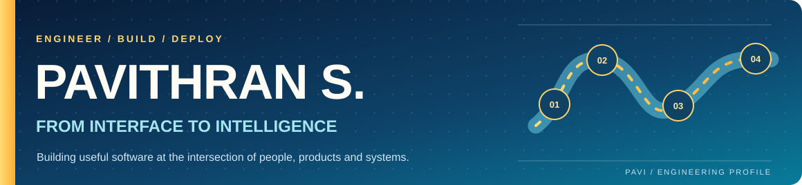

  

### Hey, I'm Pavi 👋

**Forward Deployed Engineer (FDE)** · Full Stack · Applied AI · Cloud

*I like the space between a good idea and a product people can actually use.*

---

## 01 / What I build

My work connects **interfaces, backend services, AI retrieval workflows and cloud infrastructure**. I enjoy understanding the actual problem, choosing an architecture that fits, and getting the result into a usable product.

`01  EXPLORE` → understand the workflow & user need  
`02  ENGINEER` → build the interface, APIs & data flow  
`03  INTELLIGENCE` → integrate AI where it genuinely helps  
`04  DELIVER` → deploy, test, learn & improve

## 02 / Selected builds

Real project problems, different systems and distinct engineering decisions.

### [ClanSure ↗](https://clansure.vercel.app/) 01 · INSURTECH / AI

Family insurance and policy-management experience with AI-assisted document understanding.

**Built around:** React, ASP.NET Core 8, FastAPI RAG services, PostgreSQL and object storage.

[Launch app](https://clansure.vercel.app/) · [API](https://clansure-api.onrender.com/) · [RAG service](https://clansure-rag.onrender.com/) · [Source](https://github.com/Pavithran26/CLANSURE)

---

### [GT Companion ↗](https://gt-companion.vercel.app/) 02 · FULL STACK / RAG

Companion portal combining frontend experiences, backend services and a document-retrieval component.

**Built around:** React, .NET/C#, Python FastAPI and an AI/RAG microservice.

[Launch app](https://gt-companion.vercel.app/) · [Source](https://github.com/Pavithran26/GT-Companion)

---

### [Sattam AI ↗](https://github.com/Pavithran26/TN-Sattam/tree/TN_Sattam-Astra) 03 · LEGAL INFORMATION / AI

Multilingual Tamil Nadu legal-information assistant designed around curated legal documents and evidence-constrained responses.

**Active architecture branch:** React + Vite, Capacitor, FastAPI, Firebase Authentication, Firestore, vector retrieval and LLMs.

[Explore active branch](https://github.com/Pavithran26/TN-Sattam/tree/TN_Sattam-Astra) · [Repository](https://github.com/Pavithran26/TN-Sattam)

Sattam AI provides legal information, not professional legal advice. The active branch is more current than the default-branch README.

---

### [SRK Coconut ERP ↗](https://ranjiths.vercel.app/) 04 · BUSINESS OPERATIONS

A business-oriented application for organizing day-to-day coconut business workflows.

**Focus:** operational interfaces, workflow design and usable business software.

[Launch app](https://ranjiths.vercel.app/)

<b>One more creative build: PrismIQ</b>

 

An interactive innovation showcase exploring 3D presentation, motion and navigable project storytelling.

[Explore PrismIQ](https://prismiq26.vercel.app/) · [Source](https://github.com/Pavithran26/PrismIQ-Portfolio)

## 03 / The toolkit

I choose the stack for the problem rather than making every problem fit the same stack.

| Domain | What I work with |
| :--- | :--- |
| **Product interfaces** | React · Next.js · TypeScript · Tailwind CSS |
| **Backend engineering** | Python · FastAPI · Django · ASP.NET Core · REST APIs |
| **Applied intelligence** | LLM integrations · RAG · embeddings · document workflows |
| **Data & storage** | PostgreSQL · Firebase / Firestore · AWS S3 |
| **Cloud & delivery** | AWS · Vercel · Render · Docker · GitHub Actions |
| **Additional experience** | Java · Flutter / Dart |

This is a cross-project toolkit, not one shared architecture for all applications.

## 04 / Along the way

🏆 **KALAM 2025 Hackathon — Champion / First Place**  
Sri Shakthi Institute of Engineering & Technology, Coimbatore · 21–22 March 2025

💼 **Software Development Intern — Cognifyz Technologies**  
April–May 2025

☕ **Java Internship Training — Internship Studio**  
Completed November 2024

<b>View selected certificates</b>

 

## 05 / On GitHub

<picture>
  <source media="(prefers-color-scheme: dark)" srcset="https://raw.githubusercontent.com/Pavithran26/Pavithran26/output/github-snake-dark.svg" />
  <source media="(prefers-color-scheme: light)" srcset="https://raw.githubusercontent.com/Pavithran26/Pavithran26/output/github-snake.svg" />
  
</picture>

<b>Open the 3D contribution graph</b>

 

---

### Have a problem worth building for?

[**PORTFOLIO ↗**](https://pavithran26.vercel.app/) &nbsp;·&nbsp;
[**LINKEDIN ↗**](https://www.linkedin.com/in/pavithran26s/) &nbsp;·&nbsp;
[**EMAIL ↗**](mailto:pavithran2004s@gmail.com)

Dream. Code. Build. Ride. Repeat. · Pavithran S.

